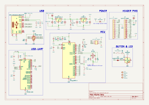
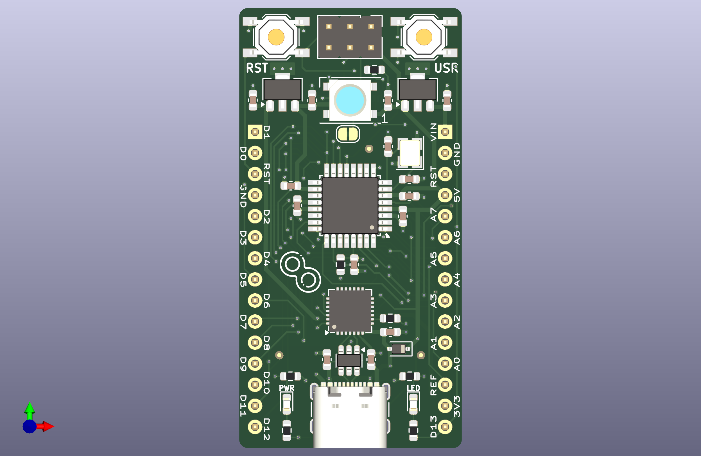

# Arduino Dolly

A clone of the Arduino Nano, but a little different.

## Overview Image

## Schematic

## 3D PCB

## Copper Layers

## todos

- [X] calculate crystal values
  - [X] calculate load capacitors - 12pf
  - [X] inspect layout - seems fine
- [X] Research USB TVS diodes
  - [X] the ones i'm using are probably not appropriate - yeah they are for RS485. FIXED
  - [X] look into what phils lab uses or the CATS board
- [X] Look into controlled impedance traces. NOT NEEDED
  - [X] calculate for the USB port. NOT DONE
- [X] Double check USB C layout
  - [X] ground the shilding
  - [X] series termination reistors? NAH
- [X] double check vreg capacitors. NEXT TIME USE 10u ON BOTH SIDES
- [X] check all capacitor dielectrics
- [X] add a fuse?. NO
- [X] review voltage selector diode. LGTM
- [X] Make a final BOM
- [X] Make production files
- [ ] Rip up traces and try alternete routing for MCU
- [X] CP2102 and others, what to do with unused pins
